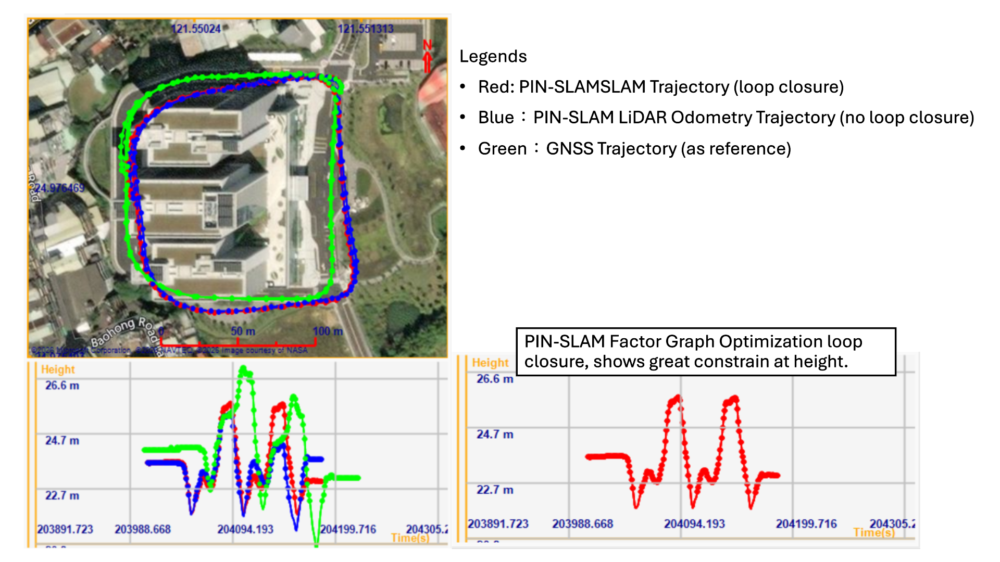

# evo_traj_to_global


## Introduction
This is a Matlab project, which aims to transform evo trajectory to global frame. For evo format, it supports transformation for data format: `tum` and `kitti`. More information about evo format, please refer to the reference.

<!-- TABLE OF CONTENTS -->
<details open="open" style='padding: 10px; border-radius:5px 30px 30px 5px; border-style: solid; border-width: 1px;'>
  <summary>Table of Contents</summary>
  <ol>
    <li>
      <a href="#result">Result</a>
    </li>
    <li>
      <a href="#run">Run</a>
    </li>
    <li>
      <a href="#config">Config</a>
    </li>
    <li>
      <a href="#reference">Reference</a>
    </li>
  </ol>
</details>


<a name="result"></a>
## Result

The transformation result provides information including [GPSTime, lat, lon, alt, roll, pitch, heading]. Chart below is the example  `tum` result transformed from demo data, which is a calculated trajectory of PIN-SLAM.

| GPSTime | Lat(deg) | Lon(deg) | Altitude(m) | Roll(deg) | Pitch(deg) | Heading(deg) |
| :--- | :--- | :--- | :--- | :--- | :--- | :--- |
| 204006.5 | 24.977026696295 | 121.551179603816 | 23.6560000730678 | 0 | 0 | 341.00639 |
| 204006.600000143 | 24.9770267477691 | 121.551179537103 | 23.6491667637601 | 0.0145662091898206 | -0.00710281950492785 | 341.029309214369 |

Figure below demonstrates the result mentioned above, which makes it easily and directly to make comparison between PIN-SLAM and reference data on the global frame (WGS84).

<p align='center'>
    
</p>

<a name="run"></a>
## Run
1. Download the whole project, and change config.m settings.
2. Open folder to src directory, then switch to the main.m file, and click run bottom to execute.

<a name="config"></a>
## Config

For the config settings, please refer to the following example.

```matlab
function cfg = config()
    % Config of Time
    cfg.time.utc = 8;  % Taiwan is UTC+8
    cfg.time.leapSec = 27;  % Leap second in 2025 is 27sec

    % Config for Test Data
    cfg.test.filePath = "../data/20250916_d_pinslam/slam_poses_tum.txt";
    cfg.test.format = 1; % 1:tum; 2:kitti
    cfg.test.timeSource = 1; % 1:fromFile (only for tum file) % 2: from LiDAR data

    % Config of LiDAR
    cfg.lidar.filePath = "../../output_raw_lidar_pcd/output/20250916_d_raw_10hz/";
    cfg.lidar.format = "pcd";
    cfg.lidar.la = [0.967, -0.037, 0.444];  % leverarm: gnss to sensor in front/right/down axes(m)
    cfg.lidar.bs = [0.235, -0.496, -79.108];  % boresight: gnss to sensor in front/right/down axes(m)
    cfg.lidar.initAtt = [0; 0; 18.99361]; % unit: deg, [roll,pitch,head], while "head" is 0 at north, 90 at west

    % Config for Reference
    cfg.ref.filePath = "../data/20250916_d_pinslam/20250916163954_d.csv";  % Filepath of the GNSS data
    
    % Config for Output
    cfg.output.timeFormat = 2; % 1:unixTime; 2:gpsTime
    cfg.output.filePath = "../output/20250916_d_pinslam_slam_tum.csv";
end
```

<a name="reference"></a>
## reference
1. evo format: https://github.com/MichaelGrupp/evo/wiki/Formats
